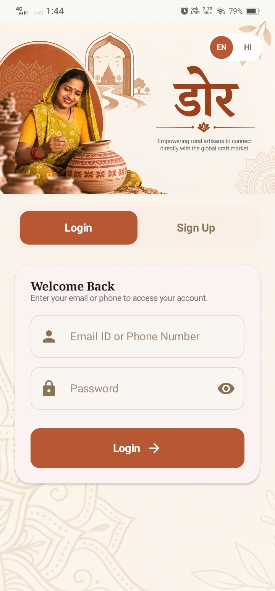
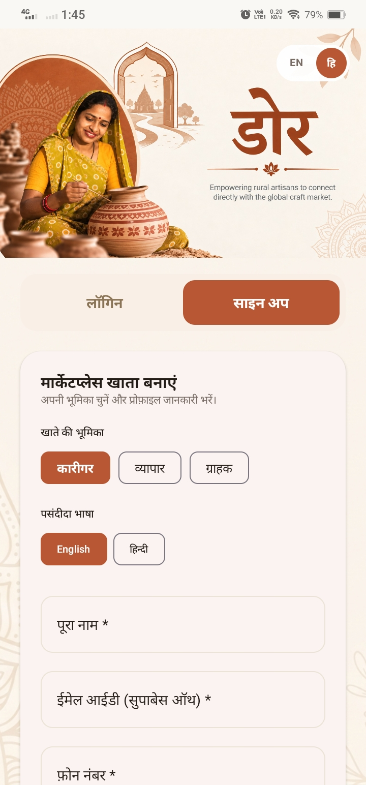
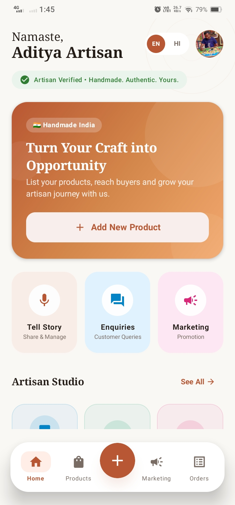
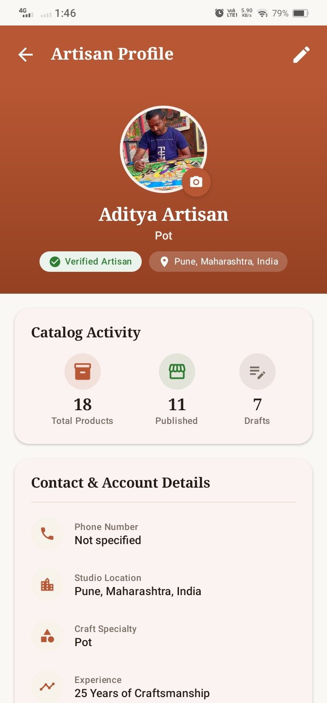
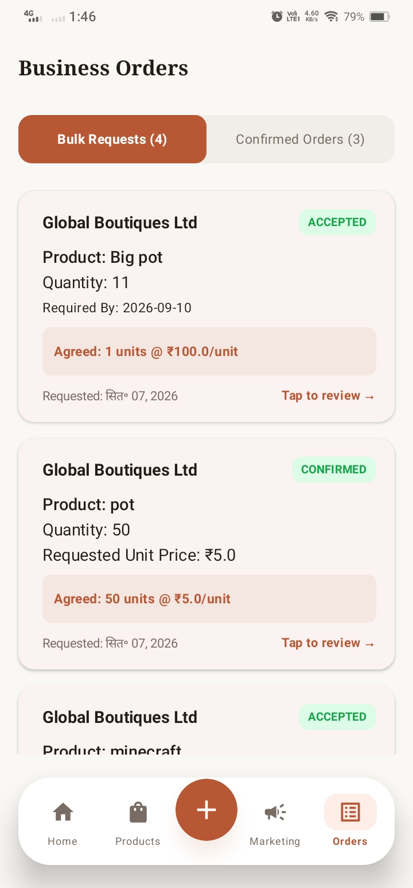
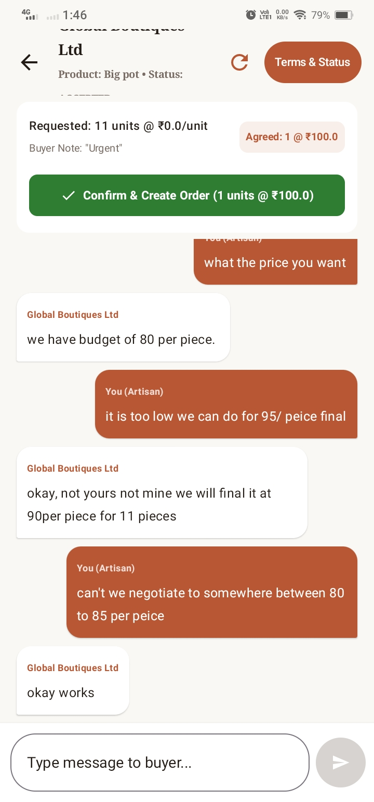
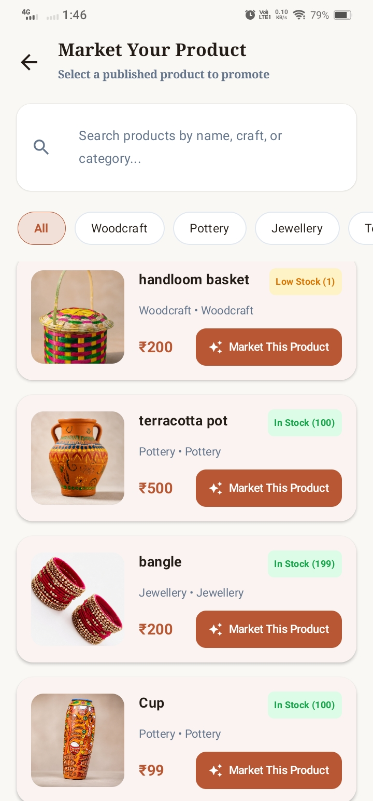

# Dor — Artisan Business Platform

Dor is an Android application designed to help marginalized and traditional artisans seamlessly manage their digital business presence. The platform provides tools to showcase products, handle bulk orders, manage their artisan profiles, and automate marketing workflows, bridging the gap between authentic craftsmanship and digital commerce.

## Features

- **Artisan Profile Management:** Create, manage, and verify artisan profiles and origin stories.
- **Product & Catalog Management:** Add, edit, and organize product listings with associated media.
- **Image Enhancement:** Integrated image upload and automatic enhancement for professional product shots.
- **Orders & Enquiries:** Receive, review, and communicate on incoming enquiries and bulk orders via dedicated chat features.
- **Marketing Hub:** Generate content and trigger automated publishing workflows across social platforms using AI.
- **Authentication:** Secure signup, login, and session management powered by Supabase Auth.

## Tech Stack

- Kotlin
- Jetpack Compose
- Material 3
- Repository-based architecture (MVVM)
- Supabase (Auth, Database, Storage)
- Ktor Client
- Coil
- Jetpack Navigation Compose
- n8n (for Marketing Workflow Automation)
- Gradle Kotlin DSL

## Architecture

The project adheres to a unidirectional data flow and repository pattern, providing a clean separation of concerns:

- **`ui/screens`**: Contains Jetpack Compose views mapping to specific app pages (Profile, Dashboard, Marketing, etc.).
- **`ui/components`**: Reusable Compose UI elements used across different screens.
- **`ui/navigation`**: Defines routes and Jetpack Navigation Compose logic.
- **`data/model`**: Kotlin data classes and serialization structures.
- **`data/remote`**: Supabase clients, Ktor providers, and connection logic.
- **`data/repository`**: Abstracts data sources and APIs (e.g., AuthRepository, ProductRepository, MarketingRepository) to provide clean interfaces to the UI layer.
- **`utils`**: Helper functions and general utilities.

The UI observes state managed by the repositories, which in turn communicate with `data/remote` services to fetch or mutate data from the Supabase backend and n8n webhooks.

## Project Structure

```
app/
├── src/main/java/com/artknower/app/
│   ├── data/
│   │   ├── local/
│   │   ├── model/
│   │   ├── remote/
│   │   └── repository/
│   ├── ui/
│   │   ├── components/
│   │   ├── navigation/
│   │   ├── screens/
│   │   └── theme/
│   └── utils/
└── src/main/res/
```

## Configuration

To protect sensitive keys, backend configuration is strictly managed through a `local.properties` file that is **not** committed to version control. The project (`app/build.gradle.kts`) is already configured to read these variables automatically and expose them safely at build time.

You must create a `local.properties` file in the root directory and define the following variables:

```properties
SUPABASE_URL=YOUR_SUPABASE_URL
SUPABASE_ANON_KEY=YOUR_SUPABASE_ANON_KEY
N8N_MARKETING_GENERATE_URL=YOUR_N8N_WEBHOOK_URL
N8N_MARKETING_PUBLISH_URL=YOUR_N8N_WEBHOOK_URL
```

## How to Run

1. Clone this repository.
2. Open the project in Android Studio (Jellyfish or newer recommended).
3. Create a `local.properties` file in the root directory.
4. Add your required configuration values (as shown above).
5. Sync the project with Gradle files.
6. Run the `app` configuration on an emulator or physical Android device.

## Screenshots

### Login & Authentication
<p align="left">
  
</p>

### Multilingual Signup
<p align="center">
  
</p>

### Dashboard / Home
<p align="center">
  
</p>

### Profile Management
<p align="center">
  
</p>

### Product Catalog
<p align="center">
  
</p>

### Bulk Chat & Orders
<p align="center">
  
</p>

### Marketing Hub
<p align="center">
  
</p>

## Future Improvements

- Implementation of Unit and UI test coverage (e.g., JUnit, Espresso, Compose Testing).
- Robust offline caching mechanism (e.g., using Room Database) to support artisans in low-connectivity regions.
- CI/CD pipeline automation via GitHub Actions.
- Comprehensive accessibility improvements across all Compose screens (e.g., TalkBack optimization, scalable fonts).

## Security

- **Ignored Configuration:** `local.properties` is strictly ignored via `.gitignore`.
- **No Committed Credentials:** Secret API keys and webhook URLs are never committed or exposed in the repository.
- **Local Environment:** Users and developers cloning this repository must provide their own backend configuration instance to compile and run the application successfully.

---
*Built with Kotlin & Jetpack Compose.*
